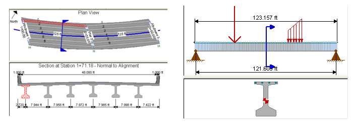

Girder Models Used In Analysis {#girder_models}
========================
It is important to understand that there are three different analytical girder models used for the TOGA analysis. They are as follows:

1. The **Per-Plan Original Girder Model**
2. The **Equivalent Original Girder Model**
3. The **Fabricator Optional Design Girder Model**
 

The TOGA program generates the second two models based on IGND/IBND information and other data made available to the TxDOT Fabrication Branch. Hence, simplifying assumptions, possibly many, are made in order to generate the models. It is very important that engineers understand these assumptions in order to determine if using TOGA is valid for their bridge design. The following sections describe each model in detail

Per-Plan Original Girder Model
------------------------------
This is the model used for the original bridge design used when creating design plan sheets. The Per-Plan model can contain a high level of detail based on the structure in question. The figure below shows an example of a very complex girder model in PGSuper (Girder 1, Span 1). It is likely that this girder should not be modeled using TOGA due to its complexity. However, this determination is left up to the bridge design engineer.

Once the Per-Plan Girder Model is designed, PGSuper can export its CAD Data which contains much of the IGND/IBND data. Plan sheets are then generated and the girder design can go on to the next step in the [design process](@ref optional_design_analysis).

Uniform Design Loads
--------------------
The only bridge input data that is not generated in the CAD Data export is the applied [Uniform_Design_Load](@ref uniform_design_load) values. This is left up to the bridge design engineer. As you might imagine, it would be a challenge to determine equivalent uniform loads for the model shown in the figure above.

<h3 id="input_response_data">Input Response Data</h3>
The following response data is taken directly from the Per-Plan Original Girder model and input into TOGA on the Bridge Input Tab. This data is referred to as **Input Response Data**.

* ft, Design Compressive Stress, Top CL (Service I, Bridge Site Stage 3)
* fb, Design Tensile Stress, Bottom CL  (Service III, Bridge Site Stage 3)
* Mu, Required Ultimate Moment (Strength I, Bridge Site Stage 3)

Input Response data is used to calibrate and check the results from the Equivalent Original Girder Model as discussed in Optional Design Analysis

Equivalent Original Girder Model
--------------------------------
This simplified model is used by TOGA to mirror the analysis of the Per-Plan girder. For simple bridges, this model can exactly reflect all aspects of the Per-Plan model. 

TOGA utilizes PGSuper to generate a simple model behind the scenes. Detailed information regarding the generated PGSuper model can be found [here](@ref model_generation). The figure below shows a typical PGSuper model exported by TOGA:

As shown above, the Equivalent Original model is part of a PGSuper bridge model. Below is a list of salient analysis assumptions made during the generation and analysis of the equivalent PGSuper model.

* Interior girder at uniform girder spacing
* Single span, simply supported
* Uniform girder types
* Straight roadway alignment
* Zero skew differential at supports
* Composite cast in place deck with uniform thickness
* Zero haunch
* Sacrificial depth of zero
* Railing system uniform load from TOGA input
* Sidewalk uniform load from TOGA input
* Overlay weight uniform load from TOGA input
* Uniform girder connection type for entire bridge
* Live load distribution factors from TOGA input
* HL-93 Live load
* Load modifiers configured per TxDOT
* Project criteria set to current TxDOT standard
* Prestressing strand and concrete material data for the original girder design are provided by TOGA input.
* All other girder data including shear stirrups and longitudinal rebar layouts are taken from the TxDOT Master Library

Once the model is generated, PGSuper performs an analysis of the original girder to compute girder stresses and camber. Refer to PGSuper's Theoretical Manual for more information about analysis methods and assumptions.

Fabricator Optional Design Girder Model
---------------------------------------
The PGSuper girder analysis model  for the Fabricator Optional Design coexists as an interior girder in the same bridge model with the Equivalent Original PGSuper girder model described in the previous section. In fact, the two girder models are identical except for prestressing strand data and concrete strength data. Hence, all modeling assumptions are the same for the two girders except for the computation of stresses. Details about stress factoring in the Fabricator Optional model are given [here](@ref optional_design_analysis). 

