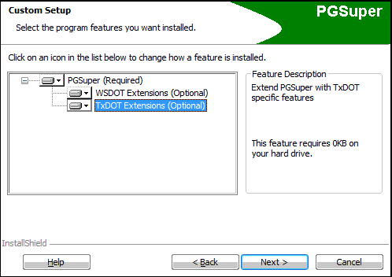

Installation and Troubleshooting {#installation}
===================

Installation
-------------
> Note: If you work at TxDOT, TOGA and PGSuper will be installed and configured automatically on your workstation by TSD so you can disregard this section.

TOGA is installed along with the main PGSuper installation and is part of the TxDOT Extensions. During installation, you will see a dialog that looks like:

Make sure the TxDOT Extensions are enabled or you will not be able to run TOGA.

PGSuper Libraries and Templates
-------------------------------
TOGA uses the TxDOT master library and templates package. *If this is not your configuration, TOGA will issue an error at run-time stating that library entries are missing*.

If you work within TxDOT, then TxDOT will be your default setting. Otherwise, PGSuper must first be configured manually as follows:

1. Make sure your computer is connected to the Internet; and your firewall software, if any, allows the program PGSuper.exe to access the Internet.
2. Run PGSuper from the Windows Start Menu
3. Select *File > Configure PGSuper* to open the Configure PGSuper dialog
4. Select "Use libraries and templates published on...."
5. Click on the server list - TxDOT should be an option. Select TxDOT.
6. Select the TxDOT libraries and templates package.
7. Click the [Update Libraries and Templates] button or [OK]. PGSuper should download the configuration files from the TxDOT server.
8. You should now be able to open .toga files and create new TOGA templates

Troubleshooting
---------------
In order to use TOGA, PGSuper must be configured per the sections above. In most cases, TOGA should work without problems, however problems can occur. Below are some possible scenarios.

### The girder/connection with name: #### does not exist in the master library
Most commonly, this error will occur if PGSuper is not configured to use the TxDOT library and templates package. Configure the program using the instructions above.
 

This can also happen if you are attempting to modify TOGA by creating your own .toga template files. Remember that library entry names are case sensitive.

### Project Criteria Entry Not Found
If this happens, a dialog is presented with the message: \"<i>The Project Criteria library entry with the name $$$ that was originally selected and saved in this TOGA project file does not exist in the current PGSuper Master Library...</i>\" You are then asked to select another Project Criteria entry. The most likely causes/fixes for this problem are as follows:

1. The TxDOT library configuration is not selected in PGSuper. As explained in the top portion of this page, PGSuper must be configured to use the TxDOT library configuration In order for TOGA to work correctly. Read the section above on **PGSuper Libraries and Templates** for information on fixing this problem.
2. You have a very old TOGA project file that references a TxDOT Project Criteria entry that has been removed from the master library file on TxDOT's web server. Contact TxDOT PGSuper support for advice on which current library entry to select.

### The TxDOT Server Does Not Appear in the Libraries and Templates list on the Configure PGSuper Dialog
This means that the PGSuper.exe program cannot see TxDOT's ftp server over the internet. Here are some possible causes in order of likelihood: 

1. Your computer is not connected to the Internet. Use your web browser to check http://www.dot.state.tx.us  
2. Firewall software on your computer  is blocking PGSuper.exe from accessing the Internet. Check your firewall configuration or contact your System Admin
3. The TxDOT ftp server is down. Use a client ftp program (e.g., FileZilla) to test an anonymous connection ftp://ftp.dot.state.tx.us/pub/txdot-info/brg/pgsuper/ 
   If no connection, try again later
4. An network/Internet error is blocking access to the TxDOT ftp server. Try again later or use an alternate Internet access method (e.g., wired connection, or cell phone tether).
5. If all else fails, contact [Support](@ref support)

