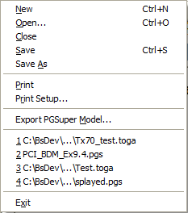
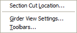
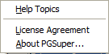

Main Menu {#ui_main_menu}
===================
Commands available from the Main Menu. All the menus are shown in this section with a brief explanation and the associated toolbar icon.

File Menu
----------

<table>
<tr>
<td ROWSPAN=11
	style="x-cell-content-align: TOP;
			width: 25%;
			padding-left: 2px;
			padding-top: 2px;
			padding-right: 2px;
			padding-bottom: 2px;"
	valign=top
	width=25%>
</td>
<td style="x-cell-content-align: TOP;
			width: 4%;
			padding-left: 2px;
			padding-top: 2px;
			padding-right: 2px;
			padding-bottom: 2px;"
	valign=top
	width=4%>

&nbsp;</td>
<td style="x-cell-content-align: TOP;
			width: 23%;
			padding-left: 2px;
			padding-top: 2px;
			padding-right: 2px;
			padding-bottom: 2px;"
	valign=top
	width=23%>

Command</td>
<td style="x-cell-content-align: TOP;
			width: 45%;
			padding-left: 2px;
			padding-top: 2px;
			padding-right: 2px;
			padding-bottom: 2px;"
	valign=top
	width=45%>

Description</td></tr>

<tr>
<td style="x-cell-content-align: TOP;
			width: 4%;
			padding-left: 2px;
			padding-top: 2px;
			padding-right: 2px;
			padding-bottom: 2px;"
	valign=top
	width=4%>

</td>
<td style="x-cell-content-align: TOP;
			width: 23%;
			padding-left: 2px;
			padding-top: 2px;
			padding-right: 2px;
			padding-bottom: 2px;"
	valign=top
	width=23%>

New</td>
<td style="x-cell-content-align: TOP;
			width: 45%;
			padding-left: 2px;
			padding-top: 2px;
			padding-right: 2px;
			padding-bottom: 2px;"
	valign=top
	width=45%>

Creates a new TOGA Project</td></tr>

<tr>
<td style="x-cell-content-align: TOP;
			width: 4%;
			padding-left: 2px;
			padding-top: 2px;
			padding-right: 2px;
			padding-bottom: 2px;"
	valign=top
	width=4%>

</td>
<td style="x-cell-content-align: TOP;
			width: 23%;
			padding-left: 2px;
			padding-top: 2px;
			padding-right: 2px;
			padding-bottom: 2px;"
	valign=top
	width=23%>

Open</td>
<td style="x-cell-content-align: TOP;
			width: 45%;
			padding-left: 2px;
			padding-top: 2px;
			padding-right: 2px;
			padding-bottom: 2px;"
	valign=top
	width=45%>

Open an existing TOGA Project</td></tr>

<tr>
<td style="x-cell-content-align: TOP;
			width: 4%;
			padding-left: 2px;
			padding-top: 2px;
			padding-right: 2px;
			padding-bottom: 2px;"
	valign=top
	width=4%>

&nbsp;</td>
<td style="x-cell-content-align: TOP;
			width: 23%;
			padding-left: 2px;
			padding-top: 2px;
			padding-right: 2px;
			padding-bottom: 2px;"
	valign=top
	width=23%>

Close</td>
<td style="x-cell-content-align: TOP;
			width: 45%;
			padding-left: 2px;
			padding-top: 2px;
			padding-right: 2px;
			padding-bottom: 2px;"
	valign=top
	width=45%>

Close the current project</td></tr>

<tr>
<td style="x-cell-content-align: TOP;
			width: 4%;
			padding-left: 2px;
			padding-top: 2px;
			padding-right: 2px;
			padding-bottom: 2px;"
	valign=top
	width=4%>

</td>
<td style="x-cell-content-align: TOP;
			width: 23%;
			padding-left: 2px;
			padding-top: 2px;
			padding-right: 2px;
			padding-bottom: 2px;"
	valign=top
	width=23%>

Save</td>
<td style="x-cell-content-align: TOP;
			width: 45%;
			padding-left: 2px;
			padding-top: 2px;
			padding-right: 2px;
			padding-bottom: 2px;"
	valign=top
	width=45%>

Save the current project</td></tr>

<tr>
<td style="x-cell-content-align: TOP;
			width: 4%;
			padding-left: 2px;
			padding-top: 2px;
			padding-right: 2px;
			padding-bottom: 2px;"
	valign=top
	width=4%>

&nbsp;</td>
<td style="x-cell-content-align: TOP;
			width: 23%;
			padding-left: 2px;
			padding-top: 2px;
			padding-right: 2px;
			padding-bottom: 2px;"
	valign=top
	width=23%>

Save As</td>
<td style="x-cell-content-align: TOP;
			width: 45%;
			padding-left: 2px;
			padding-top: 2px;
			padding-right: 2px;
			padding-bottom: 2px;"
	valign=top
	width=45%>

Save the current project with a new name</td></tr>

<tr>
<td style="x-cell-content-align: TOP;
			width: 4%;
			padding-left: 2px;
			padding-top: 2px;
			padding-right: 2px;
			padding-bottom: 2px;"
	valign=top
	width=4%>

</td>
<td style="x-cell-content-align: TOP;
			width: 23%;
			padding-left: 2px;
			padding-top: 2px;
			padding-right: 2px;
			padding-bottom: 2px;"
	valign=top
	width=23%>

Print</td>
<td style="x-cell-content-align: TOP;
			width: 45%;
			padding-left: 2px;
			padding-top: 2px;
			padding-right: 2px;
			padding-bottom: 2px;"
	valign=top
	width=45%>

Print the current view</td></tr>

<tr>
<td style="x-cell-content-align: TOP;
			width: 4%;
			padding-left: 2px;
			padding-top: 2px;
			padding-right: 2px;
			padding-bottom: 2px;"
	valign=top
	width=4%>

&nbsp;</td>
<td style="x-cell-content-align: TOP;
			width: 23%;
			padding-left: 2px;
			padding-top: 2px;
			padding-right: 2px;
			padding-bottom: 2px;"
	valign=top
	width=23%>

Print Setup</td>
<td style="x-cell-content-align: TOP;
			width: 45%;
			padding-left: 2px;
			padding-top: 2px;
			padding-right: 2px;
			padding-bottom: 2px;"
	valign=top
	width=45%>

Setup the printer</td></tr>

<tr>
<td style="x-cell-content-align: TOP;
			width: 4%;
			padding-left: 2px;
			padding-top: 2px;
			padding-right: 2px;
			padding-bottom: 2px;"
	valign=top
	width=4%>

&nbsp;</td>
<td style="x-cell-content-align: TOP;
			width: 23%;
			padding-left: 2px;
			padding-top: 2px;
			padding-right: 2px;
			padding-bottom: 2px;"
	valign=top
	width=23%>

Export PGSuper Model</td>
<td style="x-cell-content-align: TOP;
			width: 45%;
			padding-left: 2px;
			padding-top: 2px;
			padding-right: 2px;
			padding-bottom: 2px;"
	valign=top
	width=45%>

Save PGSuper analysis model of current TOGA data. See 
 [Generation of the PGSuper Model](@ref model_generation) in 
 the Theoretical Manual for details on modeling.</td></tr>

<tr>
<td style="x-cell-content-align: TOP;
			width: 4%;
			padding-left: 2px;
			padding-top: 2px;
			padding-right: 2px;
			padding-bottom: 2px;"
	valign=top
	width=4%>

&nbsp;</td>
<td style="x-cell-content-align: TOP;
			width: 23%;
			padding-left: 2px;
			padding-top: 2px;
			padding-right: 2px;
			padding-bottom: 2px;"
	valign=top
	width=23%>

Most Recent 
 Projects (1,2,3,4,...)</td>
<td style="x-cell-content-align: TOP;
			width: 45%;
			padding-left: 2px;
			padding-top: 2px;
			padding-right: 2px;
			padding-bottom: 2px;"
	valign=top
	width=45%>

Opens a recently used PGSuper Project</td></tr>

<tr>
<td style="x-cell-content-align: TOP;
			width: 4%;
			padding-left: 2px;
			padding-top: 2px;
			padding-right: 2px;
			padding-bottom: 2px;"
	valign=top
	width=4%>

&nbsp;</td>
<td style="x-cell-content-align: TOP;
			width: 23%;
			padding-left: 2px;
			padding-top: 2px;
			padding-right: 2px;
			padding-bottom: 2px;"
	valign=top
	width=23%>

Exit</td>
<td style="x-cell-content-align: TOP;
			width: 45%;
			padding-left: 2px;
			padding-top: 2px;
			padding-right: 2px;
			padding-bottom: 2px;"
	valign=top
	width=45%>

Exit TOGA</td></tr>
</table>

View Menu
-----------

<table 
		wrapperparagraphselector=P
		style="width: 100%;
				margin-top: 14pt;
				x-border-left: 1px table-solid;
				x-border-top: 1px table-solid;
				x-border-right: 1px table-solid;
				x-border-bottom: 1px table-solid;
				border-collapse: separate;
				border-spacing: 0px;
				x-border-left: 1px table-solid;
				x-border-top: 1px table-solid;
				x-border-right: 1px table-solid;
				x-border-bottom: 1px table-solid;
				border-collapse: separate;
				border-spacing: 0px;"
		cellspacing=0
		width=100%
		border=1>

<tr>
<td ROWSPAN=4
	style="x-cell-content-align: TOP;
			width: 25%;
			padding-left: 2px;
			padding-top: 2px;
			padding-right: 2px;
			padding-bottom: 2px;"
	valign=top
	width=25%>

</td>
<td style="x-cell-content-align: TOP;
			width: 5%;
			padding-left: 2px;
			padding-top: 2px;
			padding-right: 2px;
			padding-bottom: 2px;"
	valign=top
	width=5%>

&nbsp;</td>
<td style="x-cell-content-align: TOP;
			width: 21%;
			padding-left: 2px;
			padding-top: 2px;
			padding-right: 2px;
			padding-bottom: 2px;"
	valign=top
	width=21%>

Command</td>
<td style="x-cell-content-align: TOP;
			width: 49%;
			padding-left: 2px;
			padding-top: 2px;
			padding-right: 2px;
			padding-bottom: 2px;"
	valign=top
	width=49%>

Description</td></tr>

<tr style="height: 0px;">

<td style="x-cell-content-align: TOP;
			width: 5%;
			padding-left: 2px;
			padding-top: 2px;
			padding-right: 2px;
			padding-bottom: 2px;"
	valign=top
	width=5%>

&nbsp;</td>
<td style="x-cell-content-align: TOP;
			width: 21%;
			padding-left: 2px;
			padding-top: 2px;
			padding-right: 2px;
			padding-bottom: 2px;"
	valign=top
	width=21%>

Section Cut Location</td>
<td style="x-cell-content-align: TOP;
			width: 49%;
			padding-left: 2px;
			padding-top: 2px;
			padding-right: 2px;
			padding-bottom: 2px;"
	valign=top
	width=49%>

Edit the location of the section cut in the Girder View. This 
 command is only available when the Girder View is displayed.</td></tr>

<tr>

<td style="x-cell-content-align: TOP;
			width: 5%;
			padding-left: 2px;
			padding-top: 2px;
			padding-right: 2px;
			padding-bottom: 2px;"
	valign=top
	width=5%>

&nbsp;</td>
<td style="x-cell-content-align: TOP;
			width: 21%;
			padding-left: 2px;
			padding-top: 2px;
			padding-right: 2px;
			padding-bottom: 2px;"
	valign=top
	width=21%>

Girder View Settings</td>
<td style="x-cell-content-align: TOP;
			width: 49%;
			padding-left: 2px;
			padding-top: 2px;
			padding-right: 2px;
			padding-bottom: 2px;"
	valign=top
	width=49%>

Edit the view settings for the Girder View.</td></tr>

<tr>

<td style="x-cell-content-align: TOP;
			width: 5%;
			padding-left: 2px;
			padding-top: 2px;
			padding-right: 2px;
			padding-bottom: 2px;"
	valign=top
	width=5%>

&nbsp;</td>
<td style="x-cell-content-align: TOP;
			width: 21%;
			padding-left: 2px;
			padding-top: 2px;
			padding-right: 2px;
			padding-bottom: 2px;"
	valign=top
	width=21%>

Toolbars...</td>
<td style="x-cell-content-align: TOP;
			width: 49%;
			padding-left: 2px;
			padding-top: 2px;
			padding-right: 2px;
			padding-bottom: 2px;"
	valign=top
	width=49%>

Edit toolbar settings</td></tr>
</table>

<h2>Help Window</h2>

<table 
		wrapperparagraphselector=P
		style="width: 100%;
				margin-top: 14pt;
				x-border-left: 1px table-solid;
				x-border-top: 1px table-solid;
				x-border-right: 1px table-solid;
				x-border-bottom: 1px table-solid;
				border-collapse: separate;
				border-spacing: 0px;
				x-border-left: 1px table-solid;
				x-border-top: 1px table-solid;
				x-border-right: 1px table-solid;
				x-border-bottom: 1px table-solid;
				border-collapse: separate;
				border-spacing: 0px;"
		cellspacing=0
		width=100%
		border=1>

<tr>
<td ROWSPAN=4
	style="x-cell-content-align: TOP;
			width: 25%;
			padding-left: 2px;
			padding-top: 2px;
			padding-right: 2px;
			padding-bottom: 2px;"
	valign=top
	width=25%>

</td>
<td style="x-cell-content-align: TOP;
			width: 4%;
			padding-left: 2px;
			padding-top: 2px;
			padding-right: 2px;
			padding-bottom: 2px;"
	valign=top
	width=4%>

&nbsp;</td>
<td style="x-cell-content-align: TOP;
			width: 22%;
			padding-left: 2px;
			padding-top: 2px;
			padding-right: 2px;
			padding-bottom: 2px;"
	valign=top
	width=22%>

Command</td>
<td style="x-cell-content-align: TOP;
			width: 49%;
			padding-left: 2px;
			padding-top: 2px;
			padding-right: 2px;
			padding-bottom: 2px;"
	valign=top
	width=49%>

Description</td></tr>

<tr>

<td style="x-cell-content-align: TOP;
			width: 4%;
			padding-left: 2px;
			padding-top: 2px;
			padding-right: 2px;
			padding-bottom: 2px;"
	valign=top
	width=4%>

</td>
<td style="x-cell-content-align: TOP;
			width: 22%;
			padding-left: 2px;
			padding-top: 2px;
			padding-right: 2px;
			padding-bottom: 2px;"
	valign=top
	width=22%>

Help Topics</td>
<td style="x-cell-content-align: TOP;
			width: 49%;
			padding-left: 2px;
			padding-top: 2px;
			padding-right: 2px;
			padding-bottom: 2px;"
	valign=top
	width=49%>

Brings up context-sensitive help.</td></tr>

<tr>

<td style="x-cell-content-align: TOP;
			width: 4%;
			padding-left: 2px;
			padding-top: 2px;
			padding-right: 2px;
			padding-bottom: 2px;"
	valign=top
	width=4%>

&nbsp;</td>
<td style="x-cell-content-align: TOP;
			width: 22%;
			padding-left: 2px;
			padding-top: 2px;
			padding-right: 2px;
			padding-bottom: 2px;"
	valign=top
	width=22%>

License Agreement</td>
<td style="x-cell-content-align: TOP;
			width: 49%;
			padding-left: 2px;
			padding-top: 2px;
			padding-right: 2px;
			padding-bottom: 2px;"
	valign=top
	width=49%>

Displays the software license agreement and 
 disclaimers</td></tr>

<tr>

<td style="x-cell-content-align: TOP;
			width: 4%;
			padding-left: 2px;
			padding-top: 2px;
			padding-right: 2px;
			padding-bottom: 2px;"
	valign=top
	width=4%>

&nbsp;</td>
<td style="x-cell-content-align: TOP;
			width: 22%;
			padding-left: 2px;
			padding-top: 2px;
			padding-right: 2px;
			padding-bottom: 2px;"
	valign=top
	width=22%>

About PGSuper</td>
<td style="x-cell-content-align: TOP;
			width: 49%;
			padding-left: 2px;
			padding-top: 2px;
			padding-right: 2px;
			padding-bottom: 2px;"
	valign=top
	width=49%>

Displays information about TOGA / PGSuper 
 including copyright notices, version number, and build date</td></tr>
</table>

<h2>Keyboard Alternatives and Shortcuts</h2>

All commands have keyboard alternatives. Some have shortcuts. They are 
 all shown on the pull-down menus.

<h6>Keyboard Alternatives</h6>

<!--(Table)=========================================================-->
<table x-use-null-cells
		wrapperparagraphselector=P
		style="width: 100%;
				margin-top: 14pt;
				border-spacing: 0px;
				border-spacing: 0px;"
		cellspacing=0
		width=100%>

<tr>
<td style="x-cell-content-align: TOP;
			width: 14%;
			padding-left: 2px;
			padding-top: 2px;
			padding-right: 2px;
			padding-bottom: 2px;"
	valign=top
	width=14%>

ALT,_</td>
<td style="x-cell-content-align: TOP;
			width: 86%;
			padding-left: 2px;
			padding-top: 2px;
			padding-right: 2px;
			padding-bottom: 2px;"
	valign=top
	width=86%>

ALT key followed by one other key strokes 
 opens the menu that has the letter of the second key underlined. For example, 
 the File 
 menu is opened with (ALT,F)</td></tr>

<tr>
<td style="x-cell-content-align: TOP;
			width: 14%;
			padding-left: 2px;
			padding-top: 2px;
			padding-right: 2px;
			padding-bottom: 2px;"
	valign=top
	width=14%>

ALT,_,_</td>
<td style="x-cell-content-align: TOP;
			width: 86%;
			padding-left: 2px;
			padding-top: 2px;
			padding-right: 2px;
			padding-bottom: 2px;"
	valign=top
	width=86%>

ALT key followed by two other key strokes 
 opens a menu and executes a command on that menu - This sequence is an 
 extension of the one above. For example, to execute the New 
 command in the File 
 menu, use (ALT,F,N).</td></tr>
</table>

<h2>Shortcuts</h2>

Some commands have keyboard shortcuts. They are shown on the menus next 
 to the command. For example, you can save the current file by pressing 
 CTRL+S.

