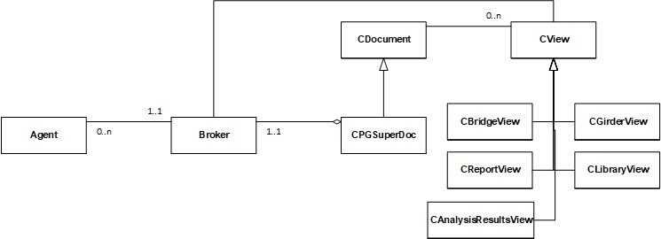
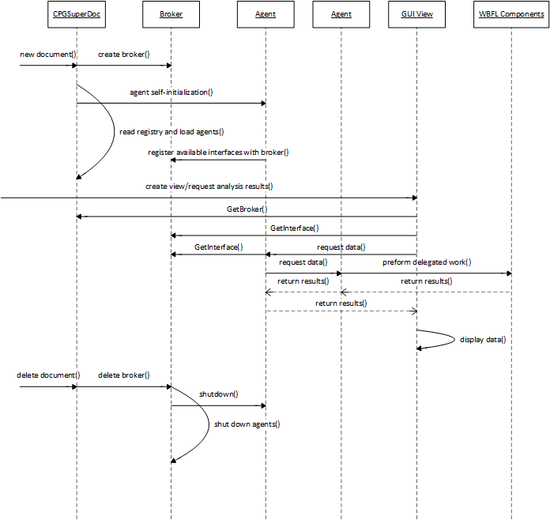

Architecture {#architecture}
============================
 # Overview
 The system architecture for PGSuper can be defined in three levels. First there is the Document View (Doc/View) architecture inherited from MFC that provides the overall structure for the event-driven graphical user interface Windows application. The Document class is not well suited to handle all of the engineering computations so this work is delegated to what is known as the Agent/Broker architecture. The Document class provides the "glue" between the engineering work and the Doc/View GUI. Finally, each "Agent" has its own internal architecture as needed.

# MFC Doc/View Architecture
The MFC Doc/View architecture is explained well in the available literature. The figure below depicts how the Doc/View architecture provides the foundation for PGSuper's GUI and how the document class bridges the Agent/Broker architecture.

# Agent/Broker Architecture
The goal of the Agent/Broker architecture is to allow "services" to be added and moved throughout the implementation without effecting existing code. Agents do all of the engineering work in PGSuper and the Broker brokers the requests for information as the agents work. When an Agent needs information, it simply goes to the Broker and requests the interface from which the information can be obtained. The requesting Agent has no idea where in the program that interface is implemented, it just knows to get the interface from the Broker and that the interface will supply the requested information.

When an Agent is on the receiving end of a request (a method on an interface that it implements is called), the Agent does whatever work is necessary to fulfill that request. This might include requesting other interfaces from the Broker, computing data, and/or looking up previously cached data.

Agents are registered with the PGSuper COM Component Category and are dynamically integrated into PGSuper at runtime. Refer to the documents [Creating a PGSuper Agent](Creating_a_PGSuper_Agent.pdf) and @subpage adding_an_interface_to_an_agent for detailed information about how Agents interact with COM.

# Agent Architectures
Each agent has its own individual architecture that supports the purpose of the agent. By design, all agents implement read-only interfaces except for the Project Agent. That is, all of the interfaces have "Get" methods except those implemented by the Project Agent. The purpose of the Project Agent is to manage the input data for a PGSuper project and thus it has read/write interfaces so the user interface classes can get the current input data, display it to the user, and set the new input data.

Much of the work done by the various agents is delegated to the services provided by the components of the Washington Bridge Foundation Libraries.

# PGSuper Agents
PGSuper is comprised of the following core agents. The core agents provides the functionality of PGSuper and PGSplice.

Agent | Description
------|------------
Analysis Agent | Responsible for structural analysis including the computation of moments, shears, reactions, displacement, and stresses
Project Agent | Responsible for managing all input parameters. This is the only agent whose interfaces are permitted to have set methods.
Bridge Agent | Responsible for modeling the bridge structure including geometric modeling
Engineering Agent | Responsible for engineering calculations such as shear and flexural strength and complience with code criteria
Report Agent | Responsible for reporting
Graphing Agent | Responsible for graphical output
Specification Agent | Responsble for implenting the LRFD specifications
Test Agent | Responsible for reporting regression test results using the concepts defined in NCHRP Project 12-50.

PGSuper also has two default extension agents. Third-parties can also create extension agents for PGSuper.

Agent | Description
------|------------
TxDOT Agent | Provides Texas DOT specific reports. 
WSDOT Agent | Provides Washington State DOT specific reports.

The TxDOT Agent is implemented in the TxDOTAgent project. This project also contains implementations for other TxDOT extensions to PGSuper and BridgeLink include the TxDOT CAD Exporter and the TOGA application.

# PGSuper Support Libraries
The PGSuper Agents depend on several support libraries.

Library | Description
--------|------------
Beams | Responsible for modeling beams of varius cross sections any any computations that are a function of the beam type
pgsLib | Library of interfaces, classes, and data elements for the PGSuper Library.
PgsExt | Library of classes used throughout PGSuper
WBFL | Washington Bridge Foundation Libraries - a collection of supporting libraries that provide a wide range of engineering computations.

# Main Sequence of PGSuper Execution
The following figure depicts the main sequence of executing PGSuper for normal program operation. This is a high level view of the main sequence, many smaller and insignificant details have been omitted for clarity and simplicity.

 

 When a user creates a new PGSuper document from the BridgeLink application, the MFC Doc/View system creates the document using a document template. 
 
 ## Document initialization
 When MFC Doc/View creates the CPGSuperDoc object, the object self-initializes by creating a new Broker object.

 The Broker object queries the Windows registry using the COM Component Categories Manager to find all objects that have been registered as PGSuper Agents. In turn, each agent is created and it's self-initialization method is called.

 During agent initialization, the Agent registers all of it's available interfaces with the Broker.

 This process is repeated for all PGSuper Extension Agents.

 New PGSuper projects are typically created from a template. A template is a pre-defined bridge model. At the conclusion of creating a new PGSuper project, there is a completely defined bridge model that is ready for analysis.

## User Actions
 Like any other interactive Windows program, PGSuper sits idol until the user takes an action. User actions are selection of menu commands, use of toolbar buttons, using the mouse to manipulate screen objects, and other common user actions. 
 
 ### Displaying Results
 The user can edit input parameters or request results. Results are requested by creating a graph or report view. The view gets the information it needs and displays it to the user. This could be data for a moment diagram, a report that shows moment capacity at a particular section of a beam, or just about anything.

 The view class gets the Broker from the Document class, requests an interface from the Broker, and calls methods on the interface to get data to display to the user.

### Getting Data from an Interface
 The agent implementing the interface must fulfill the request for data that occurs through the method call on its interface. This may be accomplished by looking up previously computed and cached data, requesting other interfaces from the Broker and using methods on those interfaces to get additional data, performing calculation, and returning the result.

 Many agents can be used to fulfill a single request for data. For example, if a beam stress is requested, the Analysis Agent has an interface that returns stress. The Analysis Agent will compute moment and divide the moment by the section modulus of the cross section to get stress (f=M/S). The Analysis Agent needs to get the beam length, weight, and boundary conditions to build the structural analysis model. This information might come from the Bridge Agent or the Project Agent. The Analysis Agent may delegate the actual structural analysis task to the WBFL::FEM2D library. The Analysis Agent needs to get the girder section modulus to compute stress from moment. This might also come from the Bridge Agent. Perhaps some special specification rules are applicable to this calculation that could be provided by the Specification Agent.

 Ultimately, the requested information is returned to the view class and it displays it to the user.

## Closing the Document
 Finally, when the PGSuper document is closed because the application is shut down or a new document opened or created, MFC deletes the CPGSuperDoc object, which deletes the Broker, which calls the ShutDown method on each agent in turn.

# Fundamental Concept
 The most fundamental concept of the PGSuper architecture is that users never have to request that an analysis is performed prior to requesting results. They simply make requests for results by opening reports and views. PGSuper knows to do whatever work is necessary to fulfill the request. This concept is carried into the PGSuper architecture in that Views, Reports, Graphs, Agents, and the like, simply request data through an interface in any order knowing that the Agent implementing the interface will do whatever work is necessary to fulfill that request.

 