Coordinate Systems {#coordinate_systems}
============================================

# Introduction
This document describes the various coordinate systems used by the PGSuper/PGSplice software.

# General Directions
PGSuper™ uses two "general directions"; Left/Right and Start/End.

Left and Right refer to the left and right hand side of something, looking head on station. Examples are left traffic barrier, right curb line, end right offset.

Start/End refers to the start or end of something looking at the bridge, girder, or other element in elevation. The start end of an element is nearest the first pier and end end is nearest the last pier. Examples are start of bridge, start of girder, and end of segment.

# General Bridge Layout
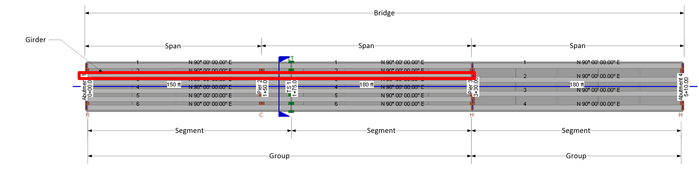{html: width=800}

The general bridge layout is made up of the following components

Bridge = the entire bridge

Spans = the units of the bridge between the permanent piers

Group = a collection of girders with the same arrangement of segments, temporary supports, and permanent supports. All of the girders in a group start and end at the same piers. A group can be made up of one or more spans. There are two groups in the figure above. Group one has 6 girders, starts and Abutment 1 and ends at Pier 3. Group 2 has 4 girders, starts at Pier 3 and ends at Pier 4. Another way to think of a group is a group of segments that are post-tensioned together to make a girder. Post-tensioning and precast-segments never cross a group boundary.

Girder = a collection of segments

Segment = a precast element

# Global Coordinates
The global coordinate system defines points in a 3D global space

Xg = Positive values are East

Yg = Positive values are North

Zg = Elevation

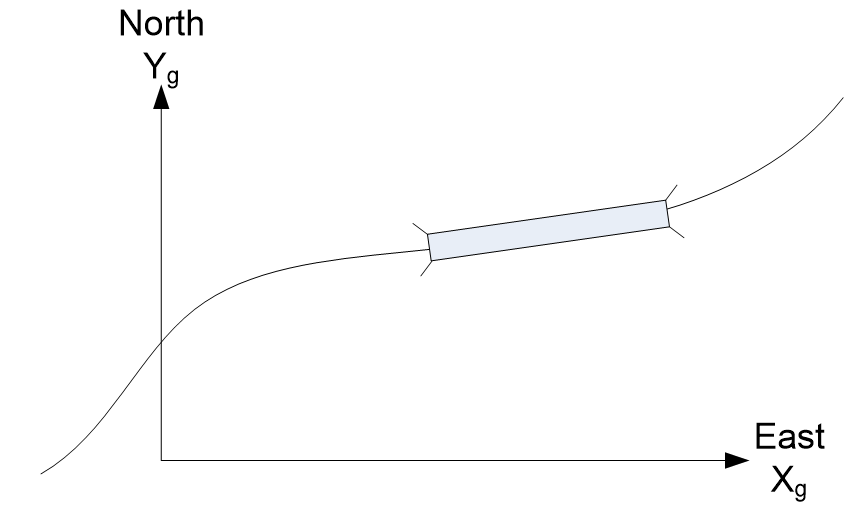

# Local Coordinates
The local coordinate system defines points in a 3D global space. The origin of the local coordinate system is at the intersection of the alignment and the pierline of the first pier. The direction of the local and global coordinates are aligned (there only translation, no rotation).

# Route Coordinates
Route coordinates are measured along the curvilinear path that represents the roadway alignment that is known as the Profile Grade Line.

Station = distance along path from starting point

Offset = distance from the path, measured normal to the path. Positive values are to the right, looking ahead on station

Elevation = elevation

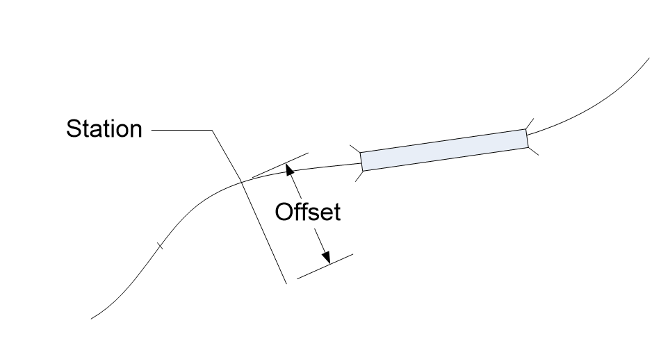

# Bridge Line Coordinates
Bridge Line coordinates are measured along the curvilinear path that represents the Bridge Line. The Bridge Line is a path that is parallel to and the alignment and offset from the alignment by an arbitrary distance.

Xb = distance along bridge line

Xb = 0 at the intersection of the reference line of the first pier and the bridge line.

Offset = distance from the bridge line, measured normal to the path. Positive values are to the right, looking ahead on station

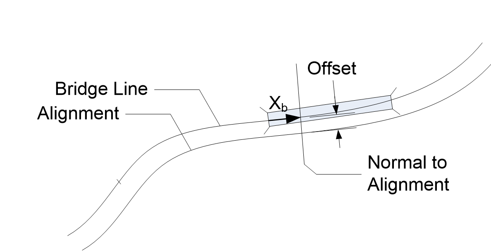

# Bridge Section Coordinates
Bridge Section Coordinates are a planar coordinate system located at each cross sectional cut of the bridge. Cross section cuts are taken normal to the alignment. The origin of the X axis is at the roadway alignment. The origin of the Y axis is at an elevation of 0. Girder, deck, and traffic barriers cross sections are located in Bridge Section Coordinates.

Xb = normal distance from the alignment (same as Offset in the Route Coordinate System)

Yb = elevation (same as Elevation in the Route Coordinate System)

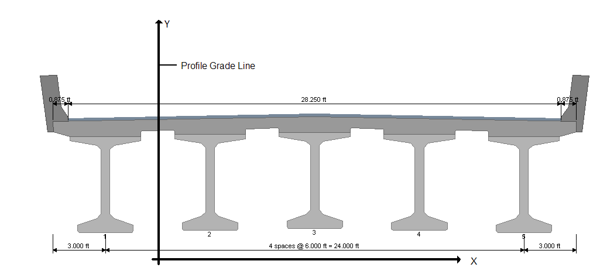

# Girder Section Coordinate System
Girder Section Coordinates are a planar coordinate system that lays in the same plan as the Bridge Cross Section coordinates. The origin of the coordinate system is the top center of the rectangle that surrounds the girder cross section. Each girder has its own Girder Section coordinates. Strands, tendons and rebar are defined in Girder Section coordinates.

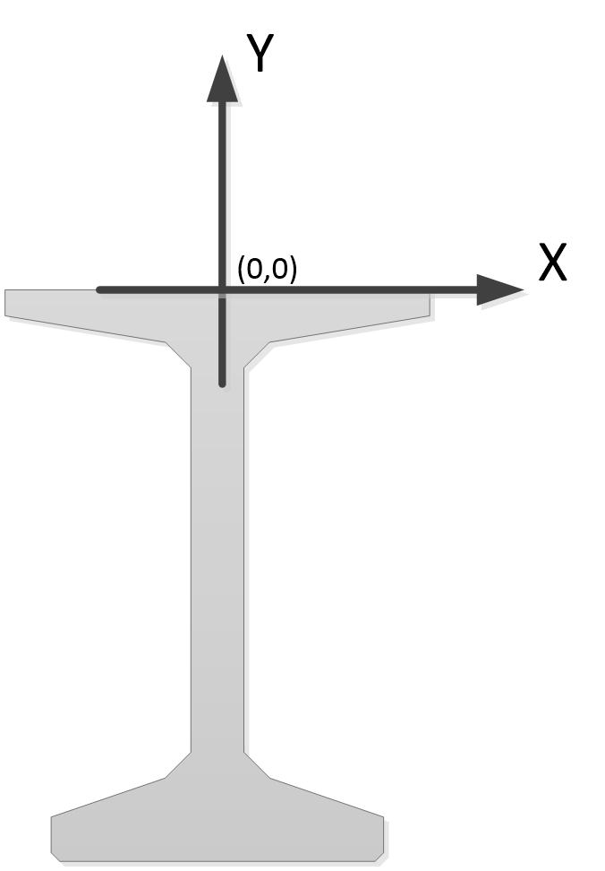

# Centroidal/Stress Point Coordinate System
Centroidal coordinates (also known as stress point coordinates) are a planar coordinate system that lays in plane of the girder cross section. The origin of the coordinate system is the centroid of the girder cross section. Each girder has its own Centroidal coordinates.

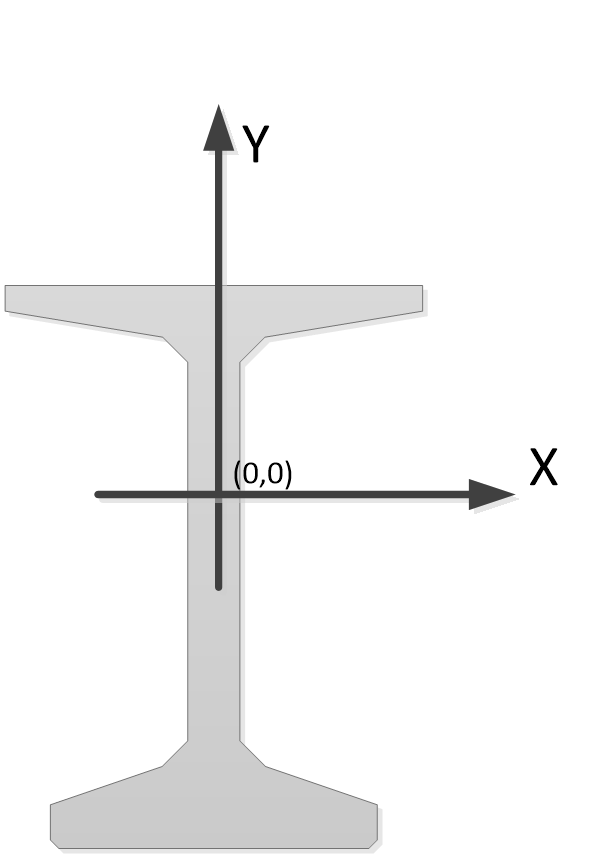

# Girder Path Coordinate System
The Girder Path Coordinate system is a one-dimensional piecewise linear coordinate system that follows the centerline of a girder. The origin of the coordinate system is at the intersection of the centerline of pier where the girder begins and the projected centerline of the girder.

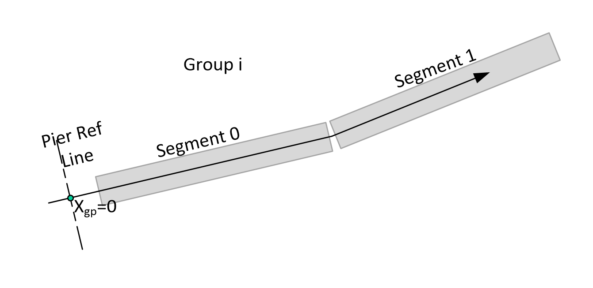

NOTE: if the bearing offset at the start abutment is input as 0, then the Pier Reference Line is at the CL Bearing. The start face of the first coordinate will be at a negative position in this coordinate system.

# Segment Path Coordinate System
The Segment Path Coordinate system is a one-dimensional coordinate system measured along the centerline of a precast segment. The origin is located at the intersection of the centerline of the support at the start of the segment (this could be a pier or a temporary support) and the projected segment centerline. The coordinate system ends at the Pier/Temp Support Reference Line for the next segment.

The segment coordinate system is longer than the segment and includes the closure joint between segments.

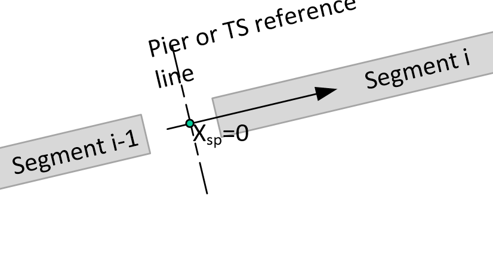

# Girder Coordinate System
The Girder Coordinate system is similar to the Girder Path Coordinate System. The origin is located at the left face of the first segment in the girder.

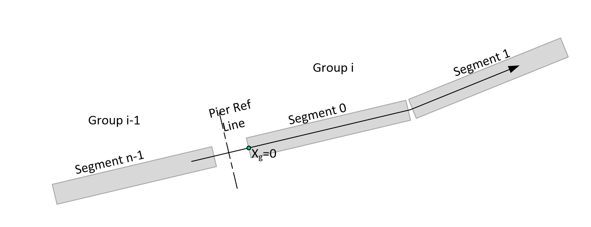

# Segment Coordinate System
The Segment Coordinate System is similar to the Segment Path Coordinate System. The origin is located at the left face of a segment.

This coordinate system is the same as Point Of Interest locations.

For spliced girders, points of interest are located at the centerline of closure joints at the end of a segment. The closure joint POI will have a coordinate value that is greater than the length of the segment.

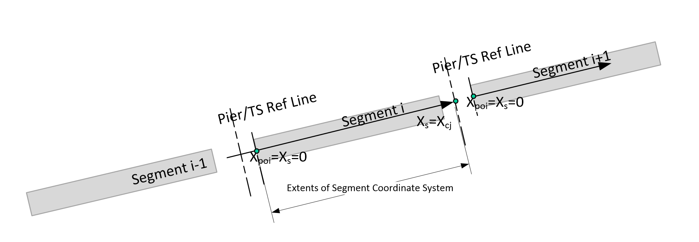

# Girder Line Coordinate System
The Girder Line Coordinate system is similar to the Girder Coordinate System. The origin is located at the left face of the first segment in the first girder the bridge. Girder Line coordinate system starts at the first segment in the first group and ends at the last segment in the last group.

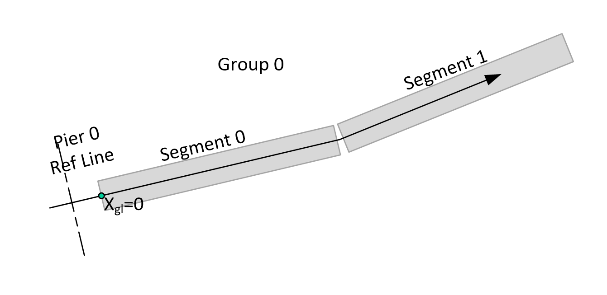

# Span Coordinate System
The Span Coordinate system is a one-dimensional piecewise linear coordinate system measured along the centerline of the girder. The origin of the coordinate system is located at the intersection of the CL Pier and the centerline of girder for each span, except for the first span, where it begins at the CL Bearing.

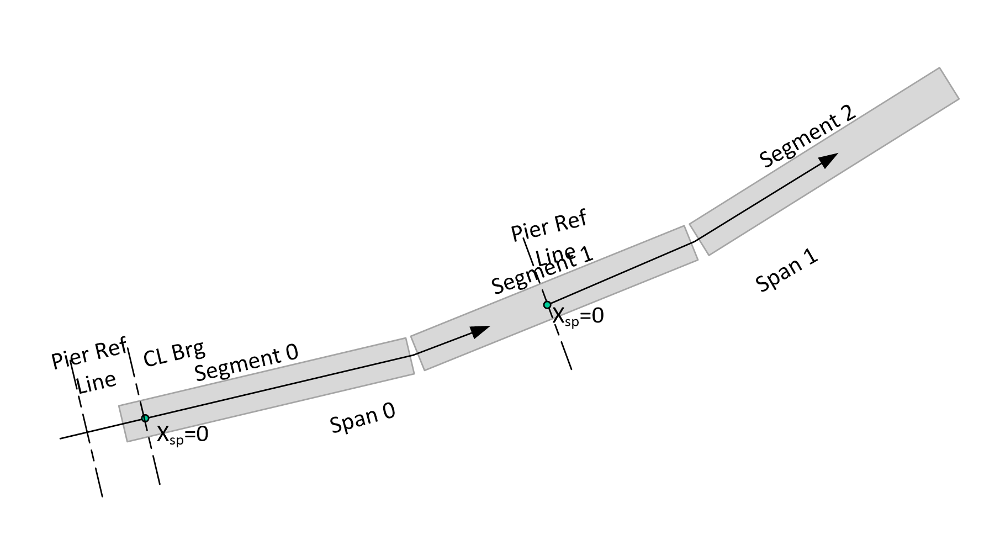

# Segment Dimensions
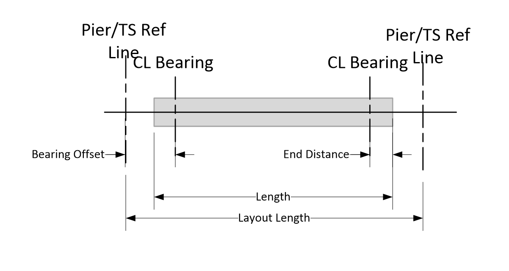

NOTE: The layout length can be shorter than the length if the bearing offset is zero. The Pier/TS Reference Line will be located at the CL Bearing.
