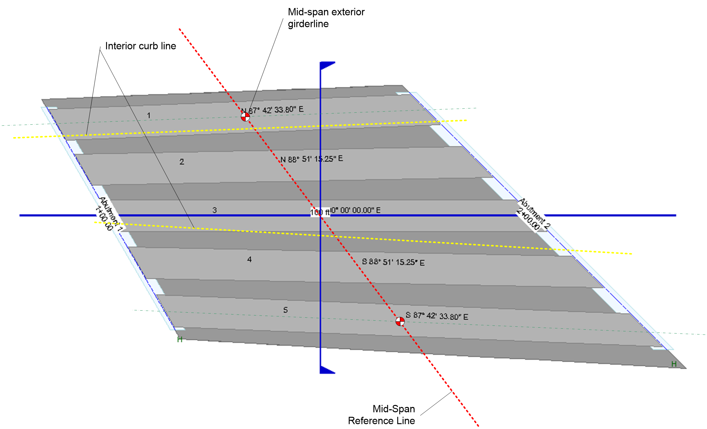
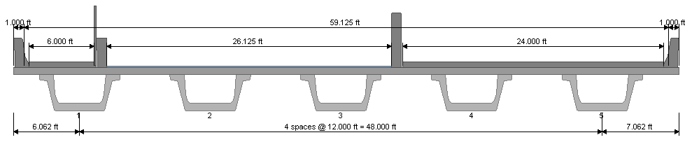
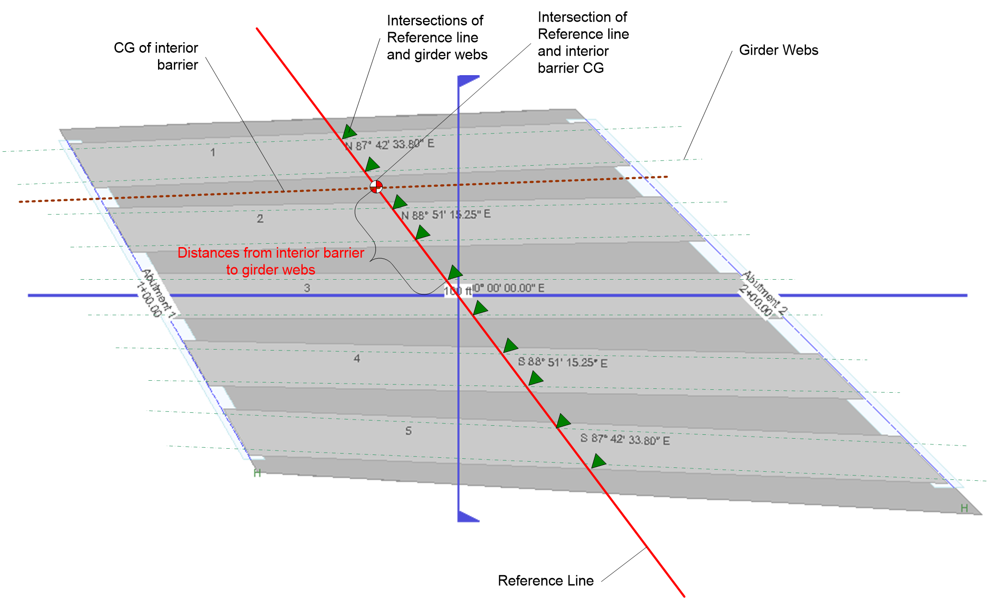

Algorithm for Determination of "N Nearest Girders, Mating Surfaces, or Webs" {#determination_of_nearest_gmsw}
================================================================================================================

This value is required to compute load distributions for interior/exterior barriers and the sidewalk/pedestrian live load. The text in the software design specification for barrier load distribution is repeated below:

> Distribute the weight of the barrier evenly to the N nearest girders, mating surfaces, or webs (GMSW's). Nearest distance is measured from the C.G. of the barrier in a bridge cross section taken at mid-span. For cases when the weight of a barrier can be distributed to either of two GMSW's that are equal distance left and right of the barrier C.G., and these GMSW's are furthest from the barrier, the load will be distributed to the exterior-most GMSW. If the span contains 2N or fewer GMSW's, the railing load will be distributed evenly to all GMSW's.

Further clarification is required for what is mid-span? And, along what line is "nearest" measured? These definitions must be consistent for any PGSuper configuration. The purpose of this document is to define these terms and present a general method for computing them.

A somewhat complex PGSuper single span model is shown in the following figure:

{html: width=800}

The Mid-Span Reference Line shown in the figure defines "mid-span" for purposes of this article. The line extends from the mid-span points of the two exterior girders. For single girder models, mid-span is at mid-girder extending normal to the roadway alignment.

The figure below shows a typical section value for the plan shown above. Note that reference lines for load distribution must be located at the C.G.'s of all barriers, and at the centerline of the sidewalk.

The plan view below shows the reference line for the CG of the left interior barrier for the case when loads are distributed to girder webs. Distances from the barrier are measured from the intersection of the mid-span reference line and the barrier C.G. line to the intersections to the girder web lines with the mid-span reference line. The N closest webs are determined using these distances.

{html: width=800}

Distances from other barrier types and the sidewalk centerline to GSMW's are determined in a similar manner.
