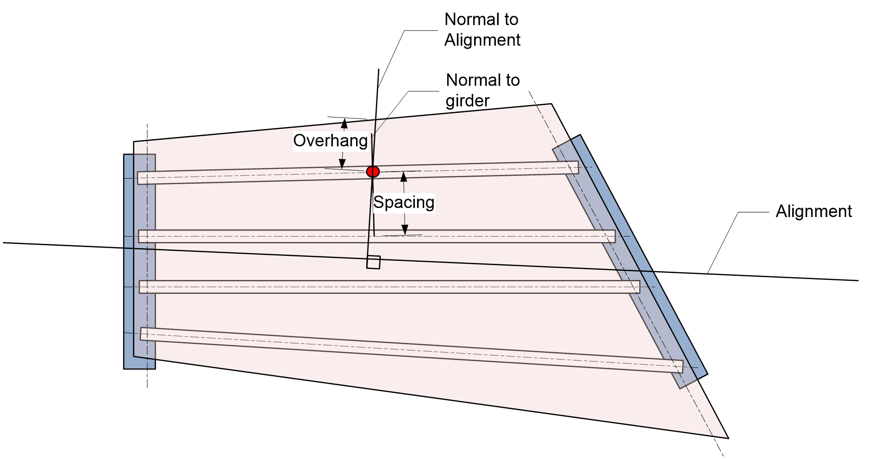

Effective Flange Width and Tributary Width {#effective_flange_width}
=====================================================================

# LRFD Before 2008
For the effective flange width, the slab overhang for exterior girders is measured along a line normal to the alignment passing through the point in question. The girder spacing is measured normal to the girder. Girder line and slab edges are projected as needed.

{html: width=800}

The tributary width is computed with girder spacing and slab overhang measured normal to girder in question. Girder line and slab edges are projected as needed.

# LRFD 2008 and Later
Effective flange width is taken to be the tributary width. The tributary width is computed with girder spacing and slab overhang measured normal to the girder in question. Girder line and slab edges are projected as needed.
