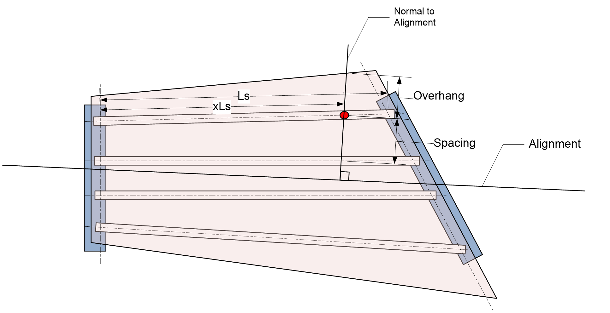
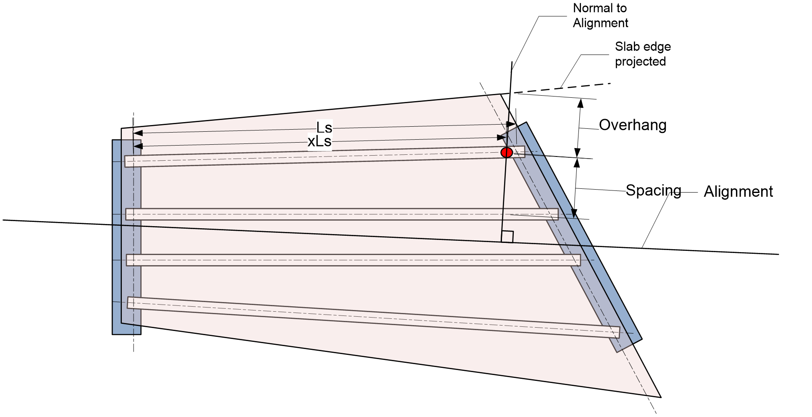
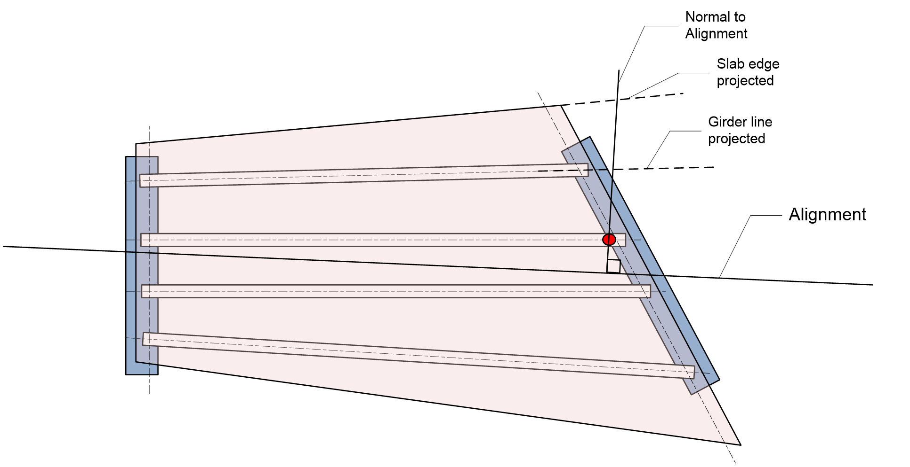

Girder Spacing for Live Load Distribution Factor Calculations {#girder_spacing_lldf}
=====================================================================================

Girder spacing and slab offset is measured at a user specified point on a girder. The point is located a fraction (x) of the bearing-to-bearing span length (Ls) measured from the CL bearing. The point where girder spacing and slab offset are measured is indicated by the red dot in the figure below.

The girder spacing and slab offset are measured long a line passing through this point and intersects with the alignment at a right angle.

{html: width=800}

Spacing is used in the live load distribution factor equations and for the lever rule.

Overhang is used to compute de which is used in the live load distribution factor equations.

At some location along the girder, the line that is normal to the alignment will no longer intersect the slab edge. In this case, the normal line is intersected with the slab edge projected

{html: width=800}

Girder lines that don't intersect the line normal to the alignment are also projected

{html: width=800}
