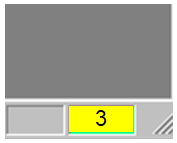
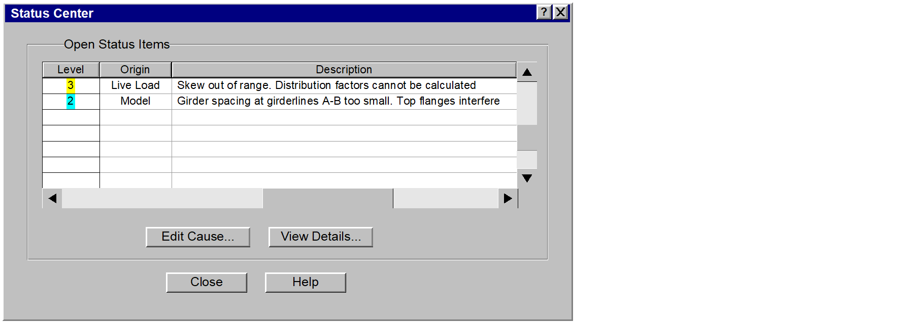
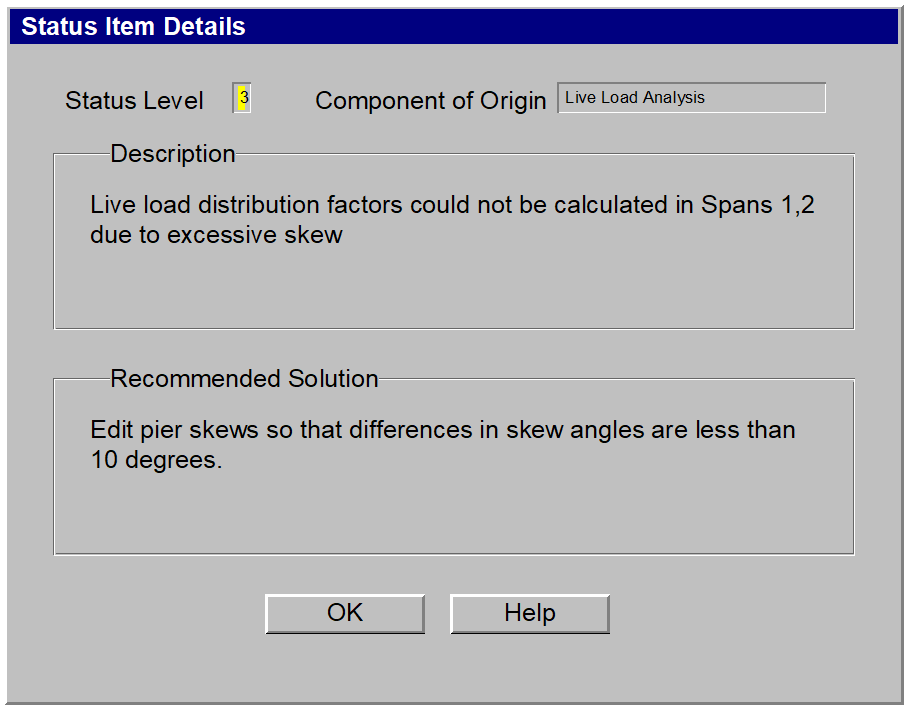

Handling of Input "Errors" in PGSuper {#handling_of_input_errors}
====================================================================

In general, computer programs are intolerant and arrogant. Most programs consider it a "user error" or an "input error" when given input data that they cannot handle. These types of situations are typically rectified by an "error dialog" that rudely gets in your face until the data is changed to the program's liking (or until you give up and use another program). In fact, these "errors" are typically not due to a mistake made by the user, but by the program's inability to perform the task at hand.

This is not to say that programs should just quietly accept data that it can't deal with and blindly calculate and report results based on them. Users must be informed if their input creates physically impossible situations, surpasses known limitations of the program, or just doesn't make sense. However, we believe that problems with input data should be presented in a more tactful and productive manner. Our solutions to handling input "errors" are given below.

# Types of Input Errors
The best way to avoid erroneous input data is simply to make it impossible for users to enter bad data. However, this is practically impossible for all but the most trivial programs. If we are to deal with input errors, we must first know where they come from. For our purposes, we have categorized errors into three categories: 1) Simple Errors, 2) Suspicious Errors, and 3) Complex Errors.

Simple Errors are straightforward and can be detected and prevented directly at the time of input. An example of a simple error is if the user input a negative modulus of elasticity, or a negative span length. Another example of a simple error is a syntax error (e.g., entering "abc" as a floating point value). Errors of this type are typically restricted to a single dialog and can be rejected directly in the dialog that they are entered in.

Suspicious Errors represent data that is possible, but not within the normal range expected. An example of this would be an 85 degree skew angle, or an elastic modulus of concrete of 30ksi. These values may be mathematically possible, but are not practical in the real world. In these cases, we will want to inform the user that something may be wrong, but still allow him to continue his work.

Complex Errors stem from problems caused by dependencies on other data. An example of this could occur if a user wants to move his entire bridge by changing the stationing of each pier. During this process, he might place pier 1 down station from pier 3. This is clearly an error, but it is only temporary - he will soon get around to moving the other piers, and he should not be harassed by the program getting in his face about it.

# Dealing With Simple Errors
The program should deal with simple errors immediately. It should not be possible to close a dialog if it has "abc" in a field that requires a floating-point number, or a negative value is input where it makes no sense. These types of errors are trapped directly at the dialog level.

# Dealing with Suspicious and Complex Errors - The Status Center
In the preceding paragraphs, we have decided that users should not be forced into dealing with suspicious and complex errors immediately. This means that we need a user interface element that serves to remind users that problem(s) exist, but does not force them to fix them immediately if they don't want to. This is the purpose of the Status Center.

The Status Center has two main viewable elements in the user interface: A color bar in the Status Bar of the main application window, and a modeless dialog that displays active status items. It is also accessible from the main menu via View | Status Center.

## Status Center Color Bar
The Status Center Color Bar is located in the far right side of the status bar for the main window and is visible at all times while the application is running. The color bar, as shown in Figure 1, is filled with a color representing the state of the input data for the current project. The Status Bar also displays the total number of status items waiting in the status queue as shown in the figure below.

There are four possible states that can be represented by the color bar as shown in the following table

Color | Status Level | Description
------|--------------|------------
 | 1 | All input data is within normal operating parameters. Informational messages may be in the status center and are signified by the starburst mentioned below.
 | 2 | Input data is unusual or suspect, but analyses can be run.
 | 3 | Input data is out of range for one or more analyses (or plug-ins), but model can be viewed, exported, and processed by some analyses. Analyses with problems cannot be run.
 | 4 | Input data represents model that is physically impossible (e.g., negative span length). One or more views may not be able to display their data. Must be fixed in order to update views (should never happen).

Table 1 - Status Bar Color States

### Color Bar Mouse Interactions
The color bar supports limited mouse interactions as shown in the table below.

Action | Result
-------|-------
Pause mouse-over or Single Click | Display tooltip showing most recent, highest-level message in status queue, or "Status OK" if green.
Double Click | Bring up Status Center dialog

## Status Center Dialog
The Status Center dialog is a modeless dialog that can be access by double clicking on the Status Color Bar or via View | Status Center on the main menu.

{html: width=900}

The Status Center dialog contains a list box of status items. Each status item represents an issue with the current input data. Issues are listed in order of relative importance (as determined by the system).

The fix for some status items will be straightforward enough so that the cause can be edited directly. In this case, the issue can be double-clicked, or selected and then pressing the "Edit Cause" button. This will bring up the editing dialog for the data item with the item highlighted.

The "View Details..." button will bring up a dialog showing the details of the current status item. This dialog contains a text field that can show additional information about how to reconcile the problem in question.

